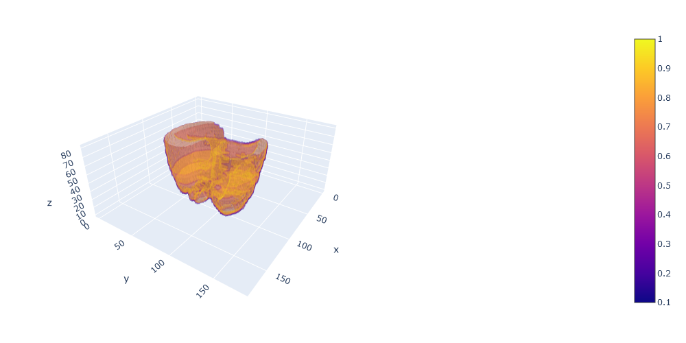

# Segmentation Practice
This repository contains a Jupyter notebook which follows the tutorial [Mr. P Solver's "Python Image Segmentation Tutorial (2022)"](https://youtu.be/UIgaLDgb2fY).

## Problem Definition and Solution
Starting from the initial CT lung scan in a form of an NumPy array the notebook follows a process of segmenting and visualizing the lungs. The starting array is a collection of scan slices containing values corresponding to Hounsfield units (HU) of the scan. By taking the  window of HU values defined in the original DICOM file into consideration filtering is done to extract the area corresponding to the lungs. Additional processing is done in the form of filling the holes in the segmented sections. Furthermore, noisy regions defined by their smaller total area and disconnect from other regions are excluded. Scaling is done to the resulting array to help reduce rendering load for visualization of the final result.

## Scan Acquisition and Preprocessing
The scan used in this practice is taken from [precision-medicine-toolbox [1]](https://github.com/primakov/precision-medicine-toolbox) and processed by [dcm2npy](https://github.com/oakjt/simple-dcm2npy).

## Visualization of the Final Result
The result of the process on [LUNG1-001_20180209_CT from [1]](https://github.com/primakov/precision-medicine-toolbox):

## References
<a id="1">[1]</a>
Precision-medicine-toolbox: An open-source python package for facilitation of quantitative medical imaging and radiomics analysis;
Sergey Primakov and Elizaveta Lavrova and Zohaib Salahuddin and Henry C Woodruff and Philippe Lambin;
2022;
2202.13965;
arXiv
